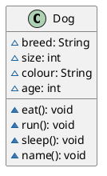
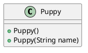

# ObjectTest

## dog简单类声明

```plantuml
@startuml
class Dog {
    ~ breed: String
    ~ size: int
    ~ colour: String
    ~ age: int

    ~ eat(): void
    ~ run(): void
    ~ sleep(): void
    ~ name(): void
}
@enduml
```

## 构造函数

```plantuml
@startuml
class Puppy {
    + Puppy()
    + Puppy(String name)
}
@enduml
```