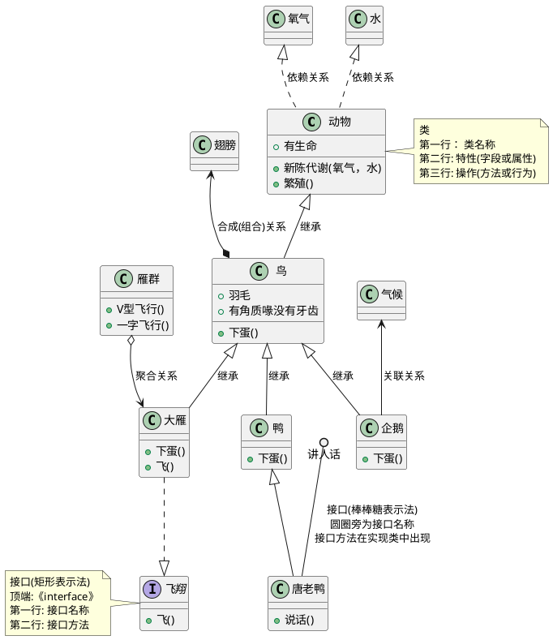

# uml类图

## uml 类图图示样例

```plantuml
@startuml
class "动物"{
    + 有生命
    + 新陈代谢(氧气，水)
    + 繁殖()
}
note right of "动物"
    类
    第一行： 类名称
    第二行: 特性(字段或属性)
    第三行: 操作(方法或行为)
end note

"氧气" <|.. "动物": 依赖关系
"水" <|.. "动物": 依赖关系

class "鸟"{
    + 羽毛
    + 有角质喙没有牙齿
    + 下蛋()
}

"动物" <|-- "鸟": 继承
"翅膀" <--*"鸟" : 合成(组合)关系

class "大雁"{
    + 下蛋()
    + 飞()
}
class "鸭"{
    + 下蛋()
}
class "企鹅"{
    + 下蛋()
}

"鸟" <|-- "大雁": 继承
"鸟" <|-- "鸭": 继承
"鸟" <|-- "企鹅": 继承

class 雁群{
    + V型飞行()
    + 一字飞行()
}

"雁群" o--> "大雁": 聚合关系
"气候" <-- "企鹅": 关联关系

interface "飞翔"{
    + 飞()
}

"大雁" ..|> "飞翔"

note left of "飞翔"
接口(矩形表示法)
顶端:《interface》
第一行: 接口名称
第二行: 接口方法
end note

class "唐老鸭"{
    + 说话()
} 

"鸭" <|-- "唐老鸭"
讲人话()-- "唐老鸭": 接口(棒棒糖表示法)\n圆圈旁为接口名称\n接口方法在实现类中出现


@enduml
```

xx
