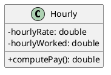
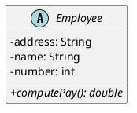
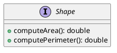
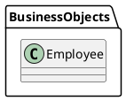
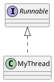
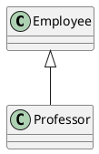
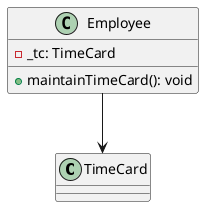
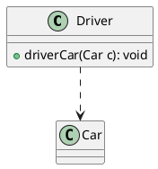
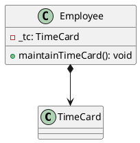

# java  uml 图绘制

## 类图中具体类、抽象、接口和包的表示法

### 在UML类图中表示具体类

具体类在类图中用矩形框表示，矩形框分为三层：第一层是类名字。第二层是类的成员变量；第三层是类的方法。成员变量以及方法前的访问修饰符用符号来表示：

```txt
“+”表示 public；
“-”表示 private；
“#”表示 protected；
不带符号表示 default。
```

说明
```java
public class Hourly {
    private double hourlyRate;
    private double hourlyWorked;
    public double computePay() {  
    }
}
```

plantuml 采用命令 skinparam classAttributeIconSize 0 来展示特殊符号本身

uml



### 在UML类图中表示抽象类

抽象类在UML类图中同样用矩形框表示，但是抽象类的类名以及抽象方法的名字都用斜体字表示。

说明

```java
public abstract class Employee {
    private String address;
    private String name;
    private int number;
    public abstract double computePay() {

    }
    public void mailCheck() {}
}
```

uml

plantuml 使用 通过修饰符{static}或者{abstract}，可以定义静态或者抽象的方法或者属性



### 在UML类图中表示接口

```txt
接口在类图中也是用矩形框表示，但是与类的表示法不同的是，接口在类图中的第一层顶端用构造型 <<interface>>表示，下面是接口的名字，第二层是方法，如图3所示。此外，接口还有另一种表示法，俗称棒棒糖表示法，就是类上面的一根棒棒糖（圆圈+实线）。圆圈旁为接口名称，接口方法在实现类中出现。
```

java

```java
public interface Shape{
    public double computeArea();
    public double computePerimeter();
}
```

uml



### 在UML类图中表示包
类和接口一般都出现在包中，UML类图中包的表示形式如图示

java

```java
package BusinessObjects;

public class Employee {

}
```

uml



## 在类图中表示关系

关系类型	符号	绘图
泛化关系	<|--	
组合关系	*--	
聚合关系	o--	
可以用.. 来代替-- ，会显示为虚线。

### 实现关系

实现关系是指接口及其实现类之间的关系。在UML类图中，实现关系用空心三角和虚线组成的箭头来表示，从实现类指向接口

java
```java
public interface Runnable{}
public class MyThread implements Runnable{}
```
uml



or


## 泛化关系
泛化关系（Generalization）是指对象与对象之间的继承关系。如果对象A和对象B之间的“is a”关系成立，那么二者之间就存在继承关系，对象B是父对象，对象A是子对象。例如，一个年薪制员工“is a”员工，很显然年薪制员工Salary对象和员工Employee对象之间存在继承关系，Employee对象是父对象，Salary对象是子对象。

在UML类图中，泛化关系用空心三角和实线组成的箭头表示，从子类指向父类，如图8所示。在Java代码中，对象之间的泛化关系可以直接翻译为关键字 extends。

java

```java
public class Employee {}

public class Professor extends Employee{}
```

uml



or


### 关联关系

关联关系（Association）是指对象和对象之间的连接，它使一个对象知道另一个对象的属性和方法。在Java中，关联关系的代码表现形式为一个对象含有另一个对象的引用。也就是说，如果一个对象的类代码中，包含有另一个对象的引用，那么这两个对象之间就是关联关系。

关联关系有单向关联和双向关联。如果两个对象都知道（即可以调用）对方的公共属性和操作，那么二者就是双向关联。如果只有一个对象知道（即可以调用）另一个对象的公共属性和操作，那么就是单向关联。大多数关联都是单向关联，单向关联关系更容易建立和维护，有助于寻找可重用的类。

在UML图中，双向关联关系用带双箭头的实线或者无箭头的实线双线表示。单向关联用一个带箭头的实线表示，箭头指向被关联的对象，如图9所示。这就是导航性（Navigatity）

java

```java
public class Employee {
    private TimeCard _tc;
    public void maintainTimeCard() {}
}
```

uml



### 依赖关系
依赖（Dependency）关系是一种弱关联关系。如果对象A用到对象B，但是和B的关系不是太明显的时候，就可以把这种关系看作是依赖关系。如果对象A依赖于对象B，则 A “use a” B。比如驾驶员和汽车的关系，驾驶员使用汽车，二者之间就是依赖关系。

在UML类图中，依赖关系用一个带虚线的箭头表示，由使用方指向被使用方，表示使用方对象持有被使用方对象的引用

java

```java
public class Driver{
    public void driverCar(Car c) {}
}
```

uml



### 聚合关系与组合关系

聚合（Aggregation）是关联关系的一种特例，它体现的是整体与部分的拥有关系，即 “has a” 的关系。此时整体与部分之间是可分离的，它们可以具有各自的生命周期，部分可以属于多个整体对象，也可以为多个整体对象共享，所以聚合关系也常称为共享关系。例如，公司部门与员工的关系，一个员工可以属于多个部门，一个部门撤消了，员工可以转到其它部门。

在UML图中，聚合关系用空心菱形加实线箭头表示，空心菱形在整体一方，箭头指向部分一方，

java

```java
public class Department{
    private Employee e;
    public Employee getEmployee(){};
}
```

uml

```plantuml
class Department{
    - e: Employee
    + getEmployee() Employee
}

Department o--> Employee
```

组合（Composition）也是关联关系的一种特例，它同样体现整体与部分间的包含关系，即 “contains a” 的关系。但此时整体与部分是不可分的，部分也不能给其它整体共享，作为整体的对象负责部分的对象的生命周期。这种关系比聚合更强，也称为强聚合。如果A组合B，则A需要知道B的生存周期，即可能A负责生成或者释放B，或者A通过某种途径知道B的生成和释放。

例如，人包含头、躯干、四肢，它们的生命周期一致。当人出生时，头、躯干、四肢同时诞生。当人死亡时，作为人体组成部分的头、躯干、四肢同时死亡。

在UML图中，组合关系用实心菱形加实线箭头表示，实心菱形在整体一方，箭头指向部分一方，

java

```java
public class Employee {
    private TimeCard _tc;
    public void maintainTimeCard() {}
}
```

uml

